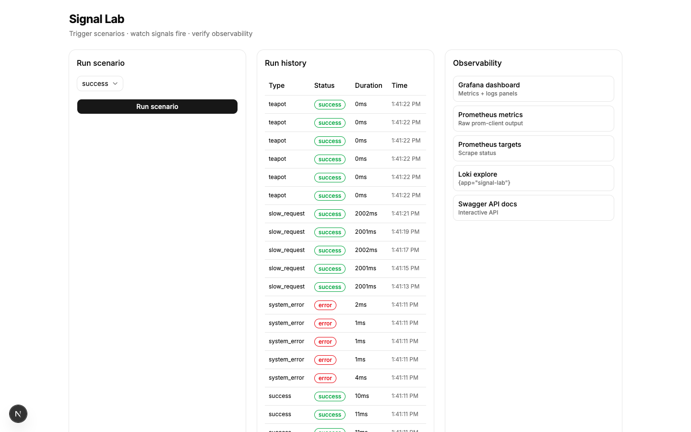
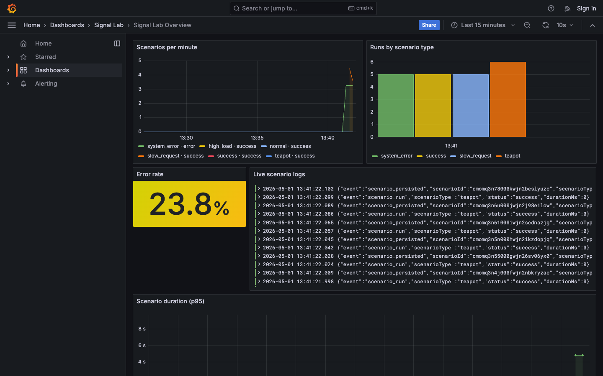
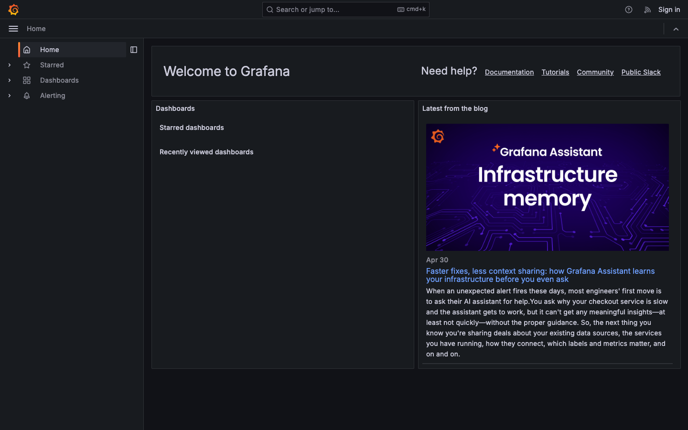
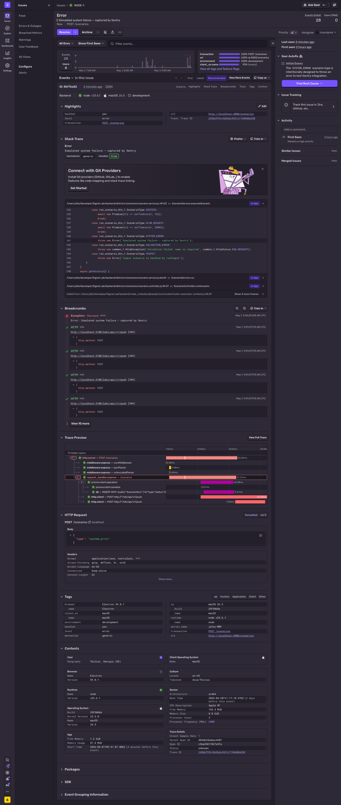

# Signal Lab

Signal Lab is a full-stack observability playground: you trigger **normal**, **high load**, or **system error** scenarios from a Next.js UI and immediately correlate the outcome in Grafana dashboards (Prometheus + Loki), structured logs in Loki, and optional error events in Sentry. It is built to show end-to-end observability wiring on a production-grade stack you can clone and demo in minutes.

## Screenshots

| UI | Grafana Dashboard |
|-----|------|
|  |  |

| Loki Logs | Sentry Error |
|-----|------|
|  |  |

## Stack

| Area | Choices |
|------|---------|
| **Frontend** | Next.js 16 · shadcn/ui · Tailwind CSS · TanStack Query · React Hook Form |
| **Backend** | NestJS · Prisma · PostgreSQL |
| **Observability** | prom-client · winston-loki · @sentry/node · Grafana · Loki · Prometheus |
| **Infra** | Docker Compose |

## Prerequisites

- Docker Desktop 4+
- Node.js 20+ (nvm recommended)
- A free Sentry DSN ([sentry.io](https://sentry.io) → New Project → Node.js → copy DSN)

## Quick start

```bash
git clone <repo-url> signal-lab && cd signal-lab
cp .env.example .env
# Open .env and replace SENTRY_DSN with your real DSN

# Start infra (postgres, prometheus, loki, grafana)
docker compose up -d postgres prometheus loki grafana

# Start backend (from repo root paths)
cd backend && npm install && npx prisma migrate deploy && npm run start:dev &

# Start frontend (new terminal tab)
cd ../frontend && npm install && npm run dev
```

Open [http://localhost:3000](http://localhost:3000)

> **Note:** With this flow the API runs on the host. Prometheus scrapes **`host.docker.internal:4000`** (see `infra/prometheus/prometheus.yml`) so counters still reach Grafana.

## Verification walkthrough

1. UI loads at [http://localhost:3000](http://localhost:3000): **Run scenario**, **Recent runs**, and **Observability** (three panels).
2. Choose **Normal** → submit → success state in the UI; **Recent runs** gains a row with status success.
3. Choose **System error** → submit → error state in the UI; open your Sentry project and confirm a new issue from the simulated failure path.
4. Choose **High load** → submit → success; duration should reflect the intentional **~200ms** delay vs other scenarios.
5. Open [http://localhost:4000/metrics](http://localhost:4000/metrics) and confirm **`signal_lab_scenarios_total`** is present with `type` / `status` labels.
6. Open [http://localhost:3001](http://localhost:3001) → **Dashboards** → **Signal Lab Overview** → all **five** panels show data after a few scenario runs (Prom scrape may take ~15–30s).
7. **Grafana** → **Explore** → **Loki** → `{app="signal-lab"}` → logs are readable JSON / structured lines including **`scenarioType`** (and related fields).
8. Open [http://localhost:4000/api](http://localhost:4000/api) → **Swagger UI** documents `POST /scenarios` and scenario history endpoints.
9. Inspect **`.cursor/`** → `rules/`, `skills/`, `commands/`, `hooks/` are all present for the Cursor AI layer (see below).

## Stop all services

```bash
# Ctrl+C in backend and frontend terminals
docker compose down
# Full reset (removes all data):
docker compose down -v
```

## Cursor AI layer

**Rules (`00-project-context.mdc` through `03-observability.mdc`):** Always-on and requestable constraints that pin the stack, forbid `console.log` in the Nest app, mandate the `signal_lab_` metric prefix and structured log shape (`scenarioId`, `scenarioType`, `status`), and require every scenario run to emit all four signals. They matter because assistants otherwise drift stacks, skip Sentry or Prisma steps, or invent metric names inconsistent with Grafana.

**Custom skills (`add-scenario`, `add-metric`, `add-log`):** Repeatable workflows for adding a scenario type end-to-end, registering a counter + Grafana panel, or emitting logs with the contract this repo expects — without re-explaining the architecture each session.

**Commands (`/new-scenario`, `/check-obs`, `/add-endpoint`, `/run-migration`):** Slash-command entry points that scaffold a scenario slice, walk an observability smoke checklist, scaffold a wired Nest endpoint, or standardize Prisma migrate steps so edits stay boring and predictable.

**Hooks (`pre-commit.sh`, `post-save-prisma.sh`):** Pre-commit typechecks frontend and backend TypeScript before a commit lands; post-save formatting on the Prisma schema prevents noisy diffs and syntax mistakes after schema tweaks.

**Orchestrator + `context.json`:** `.cursor/skills/orchestrator.md` defines phased work; **`context.json`** at the repo root records `currentPhase`, `completedTasks`, and `blockers` so you can resume in a new chat without re-summarizing the whole project. Breaking work into phases keeps each turn focused and reduces redundant context/token burn.

## Known limitations & what I'd do with +4 hours

- **Backend hot-reload** — use **`npm run start:dev`** (`ts-node-dev` + `tsconfig-paths`) instead of `nest start --watch` on Node.js v22–25 (Nest CLI / ajv-formats chain).
- **Prisma v7** uses the **`@prisma/adapter-pg` + `pg.Pool`** pattern — different from many Prisma v5/v6 tutorials; see `backend/src/prisma/prisma.service.ts`.
- **Backend and frontend run on the host in dev** for faster iteration (not required to run inside Compose for metrics; scrape target reflects that choice).
- **With +4 hours:** Playwright E2E smoke path, Grafana alert rules on error-rate / scenario failures, and a small **seed/demo** script.
